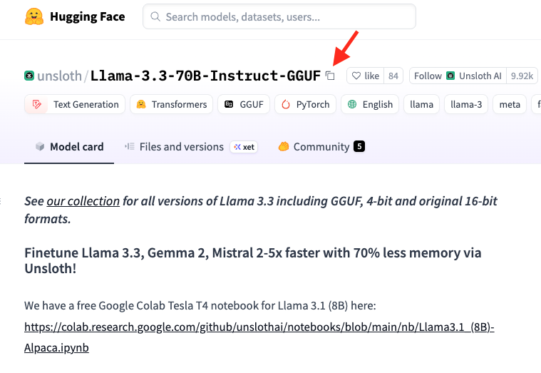
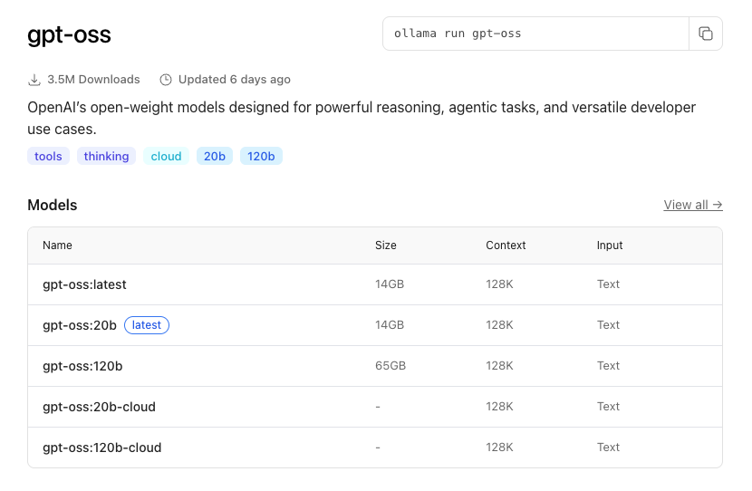

Fine-Tuning with LoRA or QLoRA
===

This is an example of using MLX to fine-tune an LLM model with low rank adaptation (LoRA).

The source of current repo originates from the official `mlx-examples` repository below,

[https://github.com/ml-explore/mlx-examples.git](https://github.com/ml-explore/mlx-examples.git)

> See the `lora` directory in the original repo above.

Basic steps for using LORA to obtain a fine-tuned model involve,

- LORA fine-Tuning

- Fuse adapter into the original model

- Convert the fused model to compatible formats, e.g., with `ollama`

- Upload the fine-tuned model to HuggingFace

The `mlx-lm` module will be used for performing the fine-tuning and model fusing conveniently. The converter script from the following repo will be used for the model conversion into the format compatible with `ollama`.

[https://github.com/ggerganov/llama.cpp](https://github.com/ggerganov/llama.cpp)

After the model fine-tuning, fusing and conversion (to `ollama` format), we will be using `ollama` to call the fine-tuned model to make predictions. To install `ollama`, follow the link [here](https://ollama.com/download). On MacOS, following the instructions [here](https://medium.com/@anand34577/setting-up-ollama-as-a-background-service-on-macos-66f7492b5cc8) to set up `ollama` to run as a background service.

Assuming `ollama` is installed, we can follow the steps below to run the model fine-tuning, fusing and conversion.

First, set up the environment (skip if already done),

```
mamba create -n mlx python=3.13
mamba activate mlx
pip install -r requirements.txt
```

Then run the script `lora_to_ollama.sh`,

```
./lora_to_ollama.sh
```

where we put together the model fine-tuning, fusing and conversion. Input parameters in the script need to be changed to reflect the converter script location and output model name, etc. Some useful resources regarding the fine-tuning and model conversion using the `mlx` framework can be found [here](https://www.youtube.com/watch?v=3UQ7GY9hNwk) and [here](https://medium.com/@meirgotroot/bringing-your-fine-tuned-mlx-model-to-life-with-ollama-integration-c54274de6491).

The script above will generate a model file named `mistral_pd.gguf` under the `models` directory (see the script above for the specification of model save location). The `ollama` command called at the end of the script will then generate `ollama` compatible model and put it in the place where `ollama` can find (usually, under `~/.ollama/models`). Names of those `ollama` model files are not human readable, and we can see what models are available with `ollama` via the `ollama list` command (see the `lora_to_ollama.sh` script above). 

> The `ollama` model creation is done through the `ollama create mistral_pd -f Modelfile` command where the `Modelfile` is generated inside the `lora_to_ollama.sh` script right before the `ollama` model creation. The created `mistral_pd` model will be overwriting the existing one (if any).

Once the fine-tuned model is available in `ollama`, we can run `ollama` with the model and see how it behaves. For such a purpose, we can go to the `ollama_call` directory and run the `ollama_call.sh` script from there,

```
cd ollama_call
./ollama_call.sh
```

which calls the Python script `ollama_main.py` in the same directory. We can change the `ollama_call.sh` script for calling the Python script differently, e.g., using a different model than the fine-tuned one to compare and see the effect of the model fine-tuning. The default model option in the script is using the fine-tuned one `mistral_pd`. Running the default script, we will see the output of the database query command. If we change the model to `mistral` (the downloaded model through the `ollama` GUI interface), we will see a pretty much general response instead.

More Notes
===

Running the `lora_to_ollama.sh` script mentioned above, we will finally obtain the `ollama` model which we can run locally with `ollama`. In fact, before the `ollama` model creation step, the model conversion step would generate the model file `mistral_pd.gguf` under the `models` directory. The `gguf` model file can be uploaded to the `HuggingFace` platform, using either the web interface or the command line interface (CLI). Assuming we are located in the `models` directory, we can run the following commands to upload the fine-tuned model to the `HuggingFace` repository. Free users have 100 GB allocation, beyond which we then need to pay.

```
hf auth login  # we need to generate the access token from the `Huggingface` web interface.
./hf_upload.sh  # check the script in `models` directory for all the running commands.
```

The `hf` command is the command line interface (CLI) for HuggingFace, which can be installed via,

```bash
pip install -U "huggingface_hub[cli]"
```

---

To download a model from HuggingFace, we can run the command like what follows,

```bash
hf download unsloth/Llama-3.3-70B-Instruct-GGUF
```

where `unsloth/Llama-3.3-70B-Instruct-GGUF` is the mode to download -- we can copy the full name of the model from the HuggingFace web interface like shown below,



The downloaded model will be saved to `~/.cache/huggingface/hub/` directory.

---

We can use the following commands to manage (e.g., scan/list and delete) HuggingFace models,

```bash
pip install -U "huggingface_hub[cli]". # do this if the `hf` command is not already available
hf cache scan
hf cache delete <model_name>
```

---

To download a model from ollama, we can first go the ollama library [here](https://ollama.com/library) and click into the model that we want, e.g., `gpt-oss`. Then we will see those alternative variations of the model, like shown below,



Then running the following command will download the specified model to locally,

```bash
ollama pull gpt-oss
```

> If no ":" is included in the model name, by default, ollama will try to pull the latest model, e.g., `gpt-oss:latest`.

Or, if we directly run the model like this,

```bash
ollama run gpt-oss
```

and if the model is not already existing locally, ollama will try to pull it first, followed by running it. To check what models are locally available to be used in `ollama`, we can run,

```bash
ollama list
```

---

Here follows is presented a list of some useful/powerful models,

- [OpenAI open access models (gpt-oss) on HuggingFace](https://huggingface.co/openai)

- [OpenAI open access models (gpt-oss) on Ollama](https://ollama.com/library/gpt-oss)

- [Ollama models library](https://ollama.com/library/)